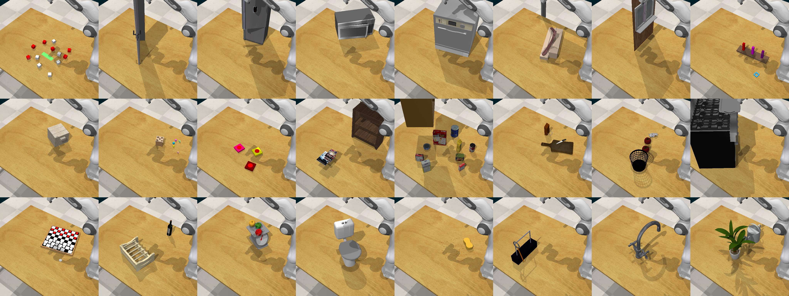

# RLBench: Robot Learning Benchmark [](https://travis-ci.com/stepjam/RLBench)



**RLBench** is an ambitious large-scale benchmark and learning environment 
designed to facilitate research in a number of vision-guided manipulation
research areas, including: reinforcement learning, imitation learning,
multi-task learning, geometric computer vision, and in particular, 
few-shot learning.

**Contents:**
- [Announcements](#announcements)
- [Install](#install)
- [Getting Started](#getting-started)
    - [Few-Shot Learning / Meta Learning](#few-shot-learningmeta-learning)
    - [Reinforcement Learning](#reinforcement-learning)
    - [Sim-to-Real](#sim-to-real)
    - [Imitation Learning](#imitation-learning)
    - [Multi-Task Learning](#multi-task-learning)
- [Task Building](#task-building)
- [Contributing](#contributing)
- [Acknowledgements](#acknowledgements)

## Announcements

- Given the scope of this project, we expect there to be a number of issues over
the coming months. Please be patient during this time. 
After the initial few weeks of release, we will tag a commit as _'V1'_, which 
should then be used for benchmarking algorithms going forward. Once there are enough 
significant changes in the future, we will tag a new _'V2'_ commit, 
and so on. Versioning like this will ensure  results remain consistent and 
reproducible as the benchmark grows.
- Currently, only **live demos** are available when requesting demos. Stored 
demos will be made available in the next few weeks.


## Install

RLBench is built around PyRep and V-REP. First head to the 
[PyRep github](https://github.com/stepjam/PyRep) page and install.

**If you previously had PyRep installed, you will need to update your installation!**

Hopefully you have now installed PyRep and have run one of the PyRep examples.
Now lets install RLBench:

```bash
pip3 install -r requirements.txt
python3 setup.py install --user
```

And that's it!

## Getting Started

The benchmark places particular emphasis on few-shot learning and meta learning 
due to breadth of tasks available, though it can be used in numerous ways.

### Few-Shot Learning / Meta Learning

We have created splits of tasks called 'Task Sets', which consist of a 
collection of X training tasks and 5 tests tasks. Here X can be 10, 25, 50, or 95.
For example, to work on the task set with 10 training tasks, we import `FS10_V1`:

```python
from rlbench.environment import Environment
from rlbench.action_modes import ActionMode, ArmActionMode
from rlbench.tasks import FS10_V1
import numpy as np

action_mode = ActionMode(ArmActionMode.ABS_JOINT_VELOCITY)
env = Environment(action_mode)
env.launch()

train_tasks = FS10_V1['train']
test_tasks = FS10_V1['test']
task_to_train = np.random.choice(train_tasks, 1)[0]
task = env.get_task(task_to_train)
task.sample_variation()  # random variation
descriptions, obs = task.reset()
obs, reward, terminate = task.step(np.random.normal(action_mode.action_size))
```

A full example can be seen in [examples/few_shot_rl.py](examples/few_shot_rl.py).

### Reinforcement Learning

```python
from rlbench.environment import Environment
from rlbench.action_modes import ActionMode, ArmActionMode
from rlbench.tasks import ReachTarget
import numpy as np

action_mode = ActionMode(ArmActionMode.ABS_JOINT_VELOCITY)
env = Environment(action_mode)
env.launch()

task = env.get_task(ReachTarget)
descriptions, obs = task.reset()
obs, reward, terminate = task.step(np.random.normal(8))
```

A full example can be seen in [examples/single_task_rl.py](examples/single_task_rl.py).
If you would like to bootsrap from demonstrations, then take a look at [examples/single_task_rl_with_demos.py](examples/single_task_rl_with_demos.py).


### Sim-to-Real

```python
from rlbench import DomainRandomizationEnvironment
from rlbench import RandomizeEvery
from rlbench import VisualRandomizationConfig
from rlbench.action_modes import ActionMode, ArmActionMode
from rlbench.tasks import OpenDoor
import numpy as np

# We will borrow some from the tests dir
rand_config = VisualRandomizationConfig(
    image_directory='../tests/unit/assets/textures')

action_mode = ActionMode(ArmActionMode.ABS_JOINT_VELOCITY)
env = DomainRandomizationEnvironment(
    action_mode, randomize_every=RandomizeEvery.EPISODE, 
    frequency=1, visual_randomization_config=rand_config)

env.launch()

task = env.get_task(OpenDoor)
descriptions, obs = task.reset()
obs, reward, terminate = task.step(np.random.normal(action_mode.action_size))
```

A full example can be seen in [examples/single_task_rl_domain_randomization.py](examples/single_task_rl_domain_randomization.py).

### Imitation Learning

```python
from rlbench.environment import Environment
from rlbench.action_modes import ArmActionMode, ActionMode
from rlbench.tasks import ReachTarget
import numpy as np

# To use 'saved' demos, set the path below
DATASET = 'PATH/TO/YOUR/DATASET'

action_mode = ActionMode(ArmActionMode.ABS_JOINT_VELOCITY)
env = Environment(action_mode, DATASET)
env.launch()

task = env.get_task(ReachTarget)

demos = task.get_demos(2)  # -> List[List[Observation]]
demos = np.array(demos).flatten()

batch = np.random.choice(demos, replace=False)
batch_images = [obs.left_shoulder_rgb for obs in batch]
predicted_actions = predict_action(batch_images)
ground_truth_actions = [obs.joint_velocities for obs in batch]
loss = behaviour_cloning_loss(ground_truth_actions, predicted_actions)

```

A full example can be seen in [examples/imitation_learning.py](examples/imitation_learning.py).

### Multi-Task Learning

We have created splits of tasks called 'Task Sets', which consist of a 
collection of X training tasks. Here X can be 15, 30, 55, or 100.
For example, to work on the task set with 15 training tasks, we import `MT15_V1`:

```python
from rlbench.environment import Environment
from rlbench.action_modes import ActionMode, ArmActionMode
from rlbench.tasks import MT15_V1
import numpy as np

action_mode = ActionMode(ArmActionMode.ABS_JOINT_VELOCITY)
env = Environment(action_mode)
env.launch()

train_tasks = MT15_V1['train']
task_to_train = np.random.choice(train_tasks, 1)[0]
task = env.get_task(task_to_train)
task.sample_variation()  # random variation
descriptions, obs = task.reset()
obs, reward, terminate = task.step(np.random.normal(action_mode.action_size))
```

A full example can be seen in [examples/multi_task_learning.py](examples/multi_task_learning.py).

## Task Building

The task building tool is the interface for users who wish to create new tasks 
to be added to the RLBench task repository. Each task has 2 associated files: 
a V-REP model file (_.ttm_), which holds all of the scene information and demo 
waypoints, and a python (_.py_) file, which is responsible for wiring the 
scene objects to the RLBench backend, applying variations, defining success
criteria, and adding other more complex task behaviours.

Here are some in-depth tutorials:
- [Simple Task](tutorials/simple_task.md)
- [Complex Task](tutorials/complex_task.md)

## Contributing

New tasks using our task building tool, in addition to bug fixes, are very 
welcome! When building your task, please ensure that you run the task validator
in the task building tool.

A full contribution guide is coming soon!

## Acknowledgements

Models were supplied from turbosquid.com, cgtrader.com, free3d.com, 
thingiverse.com, and cadnav.com.